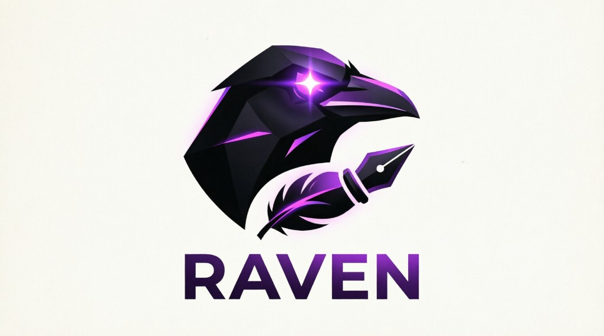

<p align="center">
  
</p>

<h1 align="center">RAVEN AI — Landing Page (UI)</h1>

<p align="center">
  <strong>Brilliant by nature. Curious by default.</strong><br/>
  Public marketing site and GitHub Pages deployment for the RAVEN AI desktop platform.
</p>

<p align="center">
  <a href="https://rabbittrix.github.io/RAVEN-AI-UI/">Live site</a> ·
  <a href="https://github.com/rabbittrix/RAVEN-AI">Desktop app (RAVEN-AI)</a> ·
  <a href="#usage-license">Usage license</a>
</p>

---

## What is RAVEN AI?

**RAVEN AI** is a local-first hybrid intelligence engine built in **Rust** for mission-critical **Finance** and **Law**. Unlike cloud-dependent assistants, RAVEN runs entirely on your machine — sovereign, deterministic, and compliance-ready.

| Capability | What it means for you |
| --- | --- |
| **Hybrid SSM + Transformer kernel** | Infinite context with O(n) efficiency — speed without sacrificing reasoning depth |
| **System 2 reasoning** | Deliberate, traceable inference — not reactive guesswork |
| **Deterministic Proof (DPC)** | Responses can be cryptographically signed and validated via Rust + WASM jurisdictional kernels |
| **Neural Vault (SurrealDB)** | Contracts, embeddings, and compliance traces stay on your hardware — always offline-capable |
| **Multi-jurisdictional guardrails** | Brazil · Ireland · Germany · Luxembourg · UK · Portugal · Spain · France · Netherlands · Norway · Global ISO |
| **Tauri + React shell** | Native desktop performance with a modern interface — Windows (.exe / .msi) and Ubuntu (.deb) |

---

## Why RAVEN AI?

1. **Zero cloud lock-in** — Your data never leaves your machine unless you choose to share it.
2. **Zero hallucination by design** — Legal and financial outputs pass through deterministic validation kernels, not probabilistic-only filters.
3. **Enterprise packaging** — Every release ships versioned installers: `raven-ai-vX.Y.Z-setup.exe`, `raven-ai-vX.Y.Z.msi`, and `raven-ai-vX.Y.Z_amd64.deb`.
4. **Transparent versioning** — Download the exact build you need directly from the [live landing page](https://rabbittrix.github.io/RAVEN-AI-UI/#download) — no redirect to an empty GitHub Releases page.
5. **3-day free trial** — Evaluate the full desktop experience before purchasing a license.

---

## How to download

Open the **Download** section on the live site. You will see every published version with selectable installers:

| Platform | File pattern |
| --- | --- |
| Windows (setup) | `raven-ai-v1.0.0-setup.exe` |
| Windows (enterprise MSI) | `raven-ai-v1.0.0.msi` |
| Ubuntu (.deb) | `raven-ai-v1.0.0_amd64.deb` |

Installers are built and published from [rabbittrix/RAVEN-AI](https://github.com/rabbittrix/RAVEN-AI) on each release, then synced here automatically.

---

## Repository structure

```text
landing-page/          React + Vite + Tailwind + Framer Motion (public site source)
.github/workflows/     Deploy to gh-pages on push (rabbittrix only)
```

See [`landing-page/README.md`](landing-page/README.md) for local development.

---

## GitHub Pages setup

**Settings → Pages → Branch:** `gh-pages` / **(root)**

Deployments are pushed by [peaceiris/actions-gh-pages](https://github.com/peaceiris/actions-gh-pages) from **RAVEN-AI** (cross-repo). Commits authored as **Roberto de Souza** only.

### One-time: add `RAVEN_SYNC_TOKEN`

The deploy step fails until you add Roberto de Souza's PAT on **RAVEN-AI**:

→ **[Setup guide](https://github.com/rabbittrix/RAVEN-AI/blob/main/.github/RAVEN_SYNC_TOKEN_SETUP.md)**  
→ **[Add secret now](https://github.com/rabbittrix/RAVEN-AI/settings/secrets/actions)**

---

## Sync & deploy pipeline

```text
authorize → build → deploy

RAVEN-AI-UI (deploy-landing.yml)
  authorize   rabbittrix-only gate
  build       npm ci + vite build  (no token required)
  deploy      peaceiris → gh-pages  (GITHUB_TOKEN or RAVEN_SYNC_TOKEN)

RAVEN-AI (deploy-to-ui.yml via sync-landing-ui.yml)
  authorize → build → deploy (cross-repo sync needs RAVEN_SYNC_TOKEN on RAVEN-AI)
```

**RAVEN_SYNC_TOKEN** (required on both repos — must be a PAT owned by **rabbittrix** / Roberto de Souza):
Fine-grained PAT with **Contents** + **Actions** read/write on both repos.
All CI pushes use this token so commits appear as **Roberto de Souza only** (never `github-actions[bot]`).
Add under **Settings → Secrets and variables → Actions → New repository secret**.

---

## Usage license

<a id="usage-license"></a>

RAVEN AI is **private proprietary software**. Copyright and all rights are held by **Roberto de Souza** (`rabbittrix@hotmail.com`).

| | |
| --- | --- |
| **Software status** | Private — not licensed for redistribution without written permission |
| **Trial** | Free 3-day evaluation of the desktop application |
| **Paid license** | **USD $39.99 per 6 months** after the trial period |
| **Third-party OSS** | Dependencies may use Apache 2.0 or other open-source terms; those licenses apply only to those components |

**Payment (bank transfer)**

| Field | Value |
| --- | --- |
| Beneficiary | Roberto de Souza |
| US routing (wire/ACH) | `026073150` |
| Account number | `8310108331` |
| SWIFT/BIC (international) | `CMFGUS33` |
| Bank | Community Federal Savings Bank |
| Address | 89-16 Jamaica Ave, Woodhaven, NY 11421, United States |

Include your name and email in the transfer reference. License activation is confirmed by the copyright owner after payment is received.

Full legal terms: [RAVEN-AI/LICENSE](https://github.com/rabbittrix/RAVEN-AI/blob/main/LICENSE)

**Disclaimer:** THE SOFTWARE IS PROVIDED "AS IS", WITHOUT WARRANTY OF ANY KIND. IN NO EVENT SHALL ROBERTO DE SOUZA BE LIABLE FOR ANY CLAIM, DAMAGES, OR OTHER LIABILITY ARISING FROM USE OF THE SOFTWARE.

---

<p align="center">
  © 2026 Roberto de Souza · All rights reserved
</p>
